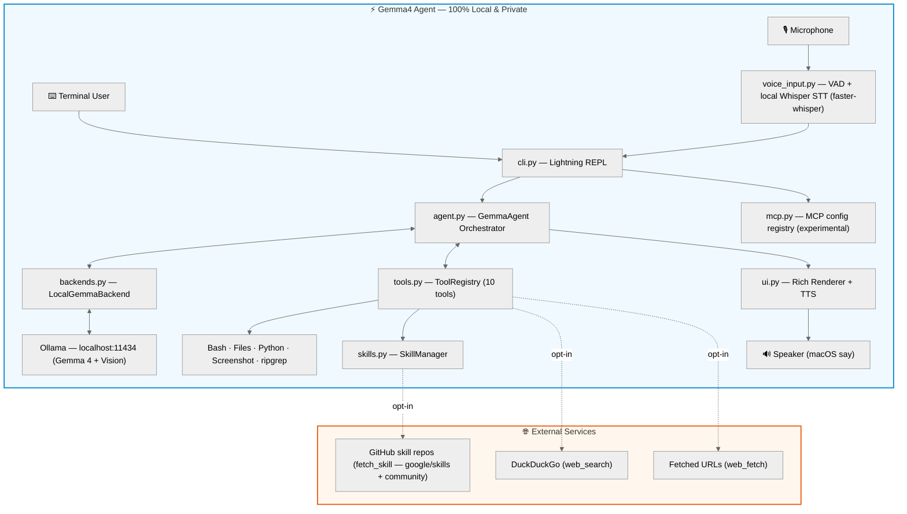

<h1 align="center">⚡ gemma4-agent</h1>

<p align="center">
  <b>Autonomous, Multimodal (Text · Vision · Voice), 100% Local & Private AI Terminal Agent Powered by Google DeepMind Gemma 4</b>
</p>

<p align="center">
  <a href="https://github.com/arjunprabhulal/gemma4-agent/blob/main/LICENSE"></a>
  <a href="https://python.org"></a>
  <a href="https://ollama.com"></a>
  
  
</p>

---

## 💡 What is `gemma4-agent`?

`gemma4-agent` is an open-source, local-first autonomous **multimodal** AI agent for terminal power users, developers, and researchers. Powered by **Google DeepMind's Gemma 4** open models running locally via **Ollama**, it lets you chat, execute terminal tasks, inspect codebases, run scripts, analyze images with Gemma 4's native vision, and talk hands-free (offline speech-to-text in, spoken answers out). **All AI inference and speech processing runs entirely on your machine — no cloud LLM APIs, no API keys, no telemetry.** The optional `web_search`, `web_fetch`, and `fetch_skill` tools access the internet only when explicitly invoked; skip them and the agent is fully offline.

<p align="center">
  
</p>

---

## ✨ Key Features & Capabilities

- 🔒 **100% Private & Local-First**: Runs fully on your hardware via local Ollama inference (`http://localhost:11434`). Zero cloud logging, zero telemetry tracking, and zero API costs.
- ⚡ **Interactive Lightning REPL**: Features a terminal interface powered by `prompt_toolkit` and `rich`, complete with command history, syntax-highlighted code previews, and live slash commands.
- 👁️ **Multimodal Vision Integration**: Include a local image file path (`.png`, `.jpg`, `.webp`) in your prompt and it is auto-detected and fed as base64 frames directly to local Gemma vision models.
- 🎙️🔊 **2-Way Hands-Free Voice Assistant Mode**: Toggle full voice assistant mode (`/voice`) to speak instructions via microphone and hear agent answers via spoken speaker output. Transcription runs on-device with [Whisper](https://github.com/openai/whisper) via the fast [faster-whisper](https://github.com/SYSTRAN/faster-whisper) implementation — your voice never leaves the machine. (Fetch the ~74MB model during setup with `gemma4-agent --setup-voice`; otherwise it downloads automatically when you first enable voice mode.)
- 🛠️ **10 Native Built-in Agent Tools**:
  - `bash_run`: Local shell command execution.
  - `read_file` & `write_file`: File inspection and creation.
  - `list_directory`: Local filesystem browser.
  - `python_eval`: On-the-fly Python script evaluator.
  - `web_fetch` & `web_search`: Privacy-focused web content extraction.
  - `fetch_skill`: Agent Skill fetcher — [google/skills](https://github.com/google/skills) by default, or any GitHub repo using the `SKILL.md` convention (the [skills.sh](https://skills.sh) ecosystem).
  - `take_screenshot`: Cross-platform desktop screenshot via `mss` (native macOS `screencapture` fallback).
  - `ripgrep_search`: High-speed regex code search across large repositories.
- 🌐 **Dynamic Agent Skills Integration**: On-demand download of skill docs injected into the agent's context — official Google Cloud skills (Cloud Run, GKE, BigQuery, AlloyDB, Spanner, and more) by default, plus community skills from any GitHub repo using the `SKILL.md` convention. Discover community skills with [`npx skills find`](https://skills.sh) and fetch them by `owner/repo`.
- 🔌 **Model Context Protocol (MCP) Registry (Experimental)**: Register and list MCP server configurations (`/mcp`). Note: server processes are not yet spawned or queried — full MCP client support is on the roadmap.
- 🧠 **Deep Reasoning Panels**: Displays `<think>...</think>` step-by-step internal planning before executing tool calls.
- 🛡 **Tool Approval Gate**: `bash_run`, `python_eval`, and `write_file` ask for your approval before executing (on by default in the REPL) — the model proposes, you decide. Disable with `/confirm off` or `--yolo`.
- ⚡ **Live Token Streaming**: Watch responses generate token-by-token (like `ollama run`), with the final answer rendered as formatted markdown — including Gemma 4's native thinking, controlled by `/think` via Ollama's think API.
- 🔎 **Automatic Grounding**: Prompts mentioning SDKs newer than the model's January 2025 cutoff (Google ADK, A2A, agents-cli, …) trigger a visible live web search first, so the model writes real APIs instead of guessing — toggle with `/ground`.
- 📊 **Local Performance Metrics**: Per-turn latency and token consumption, rendered locally in your terminal — never transmitted anywhere.

---

## 💻 Tech Stack

| Layer | Component | Technology | Description |
| :--- | :--- | :--- | :--- |
| **Language** | Core Runtime | **Python 3.10+** | Agent execution loop, tool invocation, and CLI parser |
| **AI Backend** | LLM Inference | **Ollama** | Local 100% private engine for **Google DeepMind Gemma 4** models |
| **UI & REPL** | Terminal Interface | **`prompt_toolkit` & `rich`** | History REPL, HTML/ANSI formatting, markdown panels, and tables |
| **Audio & Speech** | 2-Way Voice Mode | **`sounddevice` & `SpeechRecognition` + local Whisper (`faster-whisper`)** | Fully local microphone transcription with pause detection & native speech output |
| **Multimodal Vision** | Screenshot Tool | **`mss` (Python Screen Capture)** | Local desktop frame capture for Gemma vision model analysis |
| **Code Search** | Fast Repository Search | **`ripgrep` (`rg`)** | Lightning-fast regex code search across project directories |
| **Agent Skills** | Skill Repositories | **GitHub REST API (anonymous — no account or token needed)** | On-demand `SKILL.md` fetching from [`google/skills`](https://github.com/google/skills) and any community skill repo ([skills.sh](https://skills.sh) ecosystem), cached locally after first fetch |
| **Extensibility** | Tool Protocol | **Model Context Protocol (MCP)** | Experimental server-config registry (full MCP client on the roadmap) |

## 📋 Prerequisites

Before installing `gemma4-agent`, ensure you have:

1. **Python 3.10+** installed on macOS or Linux. (Note: spoken speech output and the screenshot fallback use macOS-native tools; on Linux, voice input and `mss` screenshots work, but speaker output is unavailable.)
2. **Ollama** installed and running locally:

   ```bash
   # Download and start Ollama
   ollama serve
   ```

3. **Download local Gemma 4 model**:

   ```bash
   # Pull Gemma 4 model
   ollama pull gemma4:26b
   # Or lighter 12B variant
   ollama pull gemma4:12b
   ```

---

## 🚀 Quick Start & Installation

### 1. Clone the Repository

```bash
git clone https://github.com/arjunprabhulal/gemma4-agent.git
cd gemma4-agent
```

### 2. Create Virtual Environment & Install

```bash
python3 -m venv .venv
source .venv/bin/activate
pip install -e .
```

### 3. Download the Local Voice Model (one-time, like `ollama pull`)

```bash
gemma4-agent --setup-voice   # caches the ~74MB Whisper model for offline voice mode
```

(Optional — if you skip it, the model downloads automatically the first time you enable `/voice`.)

### 4. Launch the Interactive REPL

```bash
gemma4-agent   # aliases: gemma-agent, gemma4
```

### 5. Custom Model Options

```bash
# Run with specific local Gemma tag
gemma4-agent --model gemma4:26b
gemma4-agent --model gemma4:12b
```

### 6. Single Execution Mode (`-e`)

```bash
# Non-interactive single query execution
gemma4-agent -e "Search for all python files in the current folder and summarize pyproject.toml"
```

---

## ⚡ Interactive Slash Commands

Inside the `gemma4-agent` REPL session, use slash commands to manage assistant modes on the fly:

| Command | Action |
| :--- | :--- |
| `/help` | Display interactive CLI help menu and command list |
| `/voice [seconds]` | Toggle 2-Way Voice Mode, with optional mic wait window (aliases: `/mic`, `/talk`) |
| `/stop` | Disable Voice Mode and return to keyboard typing (alias: `/pause`) |
| `/tools` | List all active agent tools |
| `/skills` | Display cached Agent Skills (`/skills clear` resets the cache) |
| `/mcp` | Register, list, or remove MCP server configurations (experimental) |
| `/history` | Display conversation transcript (200-char preview per message) |
| `/clear` | Reset conversation state and clear history |
| `/think [on\|off]` | Toggle step-by-step reasoning mode — off gives faster, direct answers |
| `/ground [on\|off]` | Toggle automatic live web-grounding when prompts mention post-cutoff SDKs (ADK, A2A, …) |
| `/confirm [on\|off]` | Toggle approval prompts before `bash_run`/`python_eval`/`write_file` execute (on by default; `--yolo` disables at launch) |
| `/model <tag>` | Switch active local Gemma model tag on the fly (e.g. `/model gemma4:12b`; alias: `/backend`) |
| `/exit` or `/quit` | Exit `gemma4-agent` |

---

## 🧰 Built-In Tool Reference

| Tool Name | Parameters | Description |
| :--- | :--- | :--- |
| `bash_run` | `command` | Execute shell commands on the local machine (macOS/Linux) |
| `read_file` | `filepath` | Read text contents of target file |
| `write_file` | `filepath`, `content` | Write or update target text file |
| `list_directory` | `directory_path` | List files and subdirectories with sizes |
| `python_eval` | `code` | Execute Python code snippet and return STDOUT/STDERR |
| `web_fetch` | `url` | Fetch plain text content from web URLs |
| `web_search` | `query` | Privacy-preserving web search |
| `fetch_skill` | `skill_name`, `source` (optional) | Fetch an Agent Skill from `google/skills` (default) or any GitHub `owner/repo` with `SKILL.md` files |
| `take_screenshot` | `filename` | Capture desktop screenshot to a file (`mss`, cross-platform; macOS fallback); reference the saved path in a follow-up prompt for vision analysis |
| `ripgrep_search` | `query`, `path` | High-speed regex code search across files |

---

## 🏗️ Architecture & System Design

`gemma4-agent` is structured into 4 decoupled core subsystems:

1. ⚡ **Interactive Terminal REPL (`gemma_agent/cli.py` & `ui.py`)**: Handles prompt input, slash commands (`/voice`, `/tools`, `/mcp`), rich ANSI/HTML color rendering, markdown tables, and hands-free microphone/speech synthesis.
2. 🧠 **Agent Orchestrator (`gemma_agent/agent.py`)**: Manages conversation history, `<think>...</think>` step-by-step reasoning extraction, multi-turn tool calling loops, tool call deduplication, self-healing error recovery, and performance telemetry.
3. 🦙 **Local Model Backend (`gemma_agent/backends.py`)**: Communicates with the local **Ollama** LLM engine via REST API, automatically converts local image file paths to Base64 vision frames, and tracks token consumption metrics.
4. 🛠️ **Tools & Skills Engine (`gemma_agent/tools.py`, `skills.py`, `mcp.py`)**: Provides 10 native tools (`bash_run`, `python_eval`, `take_screenshot`, `ripgrep_search`), fetches Agent Skills on demand — [`google/skills`](https://github.com/google/skills) by default plus any community `SKILL.md` repo from the [skills.sh](https://skills.sh) ecosystem — and keeps an experimental registry of Model Context Protocol (MCP) server configurations.



---

## 🧪 Running Tests

`gemma4-agent` includes a unit test suite under `tests/`, split by module (`test_agent.py`, `test_backends.py`, `test_tools.py`, `test_skills.py`, `test_mcp.py`, `test_voice_input.py`, `test_cli_e2e.py` — the last drives the real REPL end-to-end):

```bash
# Run the full test suite
python -m unittest discover -s tests -v
```

Note: two tests in `test_tools.py` use the live network (DuckDuckGo, GitHub) and skip themselves when offline.

---

## 🤝 Contributing

Contributions, bug reports, and feature requests are welcome!

1. Fork the project repository.
2. Create your feature branch (`git checkout -b feature/amazing-feature`).
3. Commit your changes (`git commit -m 'Add amazing feature'`).
4. Push to the branch (`git push origin feature/amazing-feature`).
5. Open a Pull Request.

---

## 📚 References & Resources

- 🧠 **Google DeepMind Gemma**: [Official Google DeepMind Gemma Open Models](https://deepmind.google/technologies/gemma/)
- 📦 **Google DeepMind GitHub**: [google-deepmind/gemma Repository](https://github.com/google-deepmind/gemma)
- 🌐 **Google Agent Skills**: [google/skills Repository](https://github.com/google/skills)
- 🧩 **Agent Skills Ecosystem**: [skills.sh Directory](https://skills.sh) · [vercel-labs/skills CLI](https://github.com/vercel-labs/skills)
- 🦙 **Ollama Model Library**: [Ollama Gemma 4 Models](https://ollama.com/library/gemma4)

---

## 📄 License

Distributed under the **MIT License**. See [`LICENSE`](LICENSE) for details.
